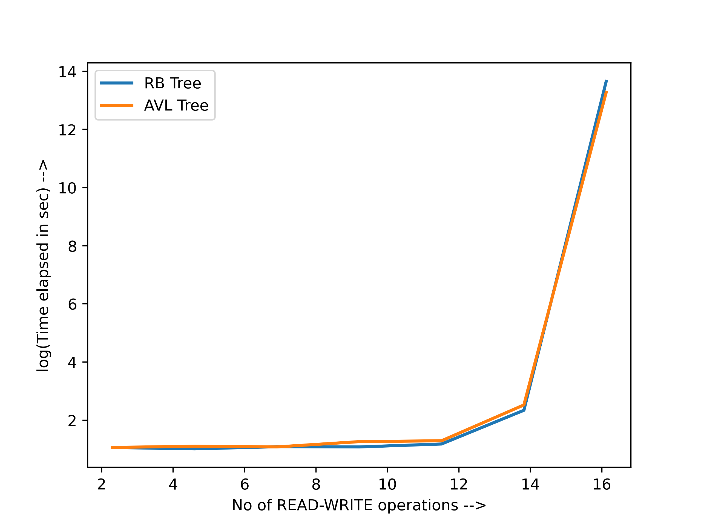

# AVL Trees: perfectly balanced, as all things should be

## Introduction
[AVL trees](https://en.wikipedia.org/wiki/AVL_tree)(named after inventors Adelson-Velsky and Landis), also known as height-balanced trees are a widely-used data structure when it comes to efficient read, write and search operations. 

Similar to a [BST(binary search tree)](https://en.wikipedia.org/wiki/Binary_search_tree), an AVL tree also has basic operations:
 - add()
 - remove()
 - search()

But what makes an AVL tree efficient and fast
 - always height balanced
   - balance factor on any node is 0 or 1
 - always achieves minimum height
   - by [rotations](https://en.wikipedia.org/wiki/Tree_rotation)

## How is it perfect balanced(as all things should be)
At the time of insertions and deletions:
 - it finds the first node where one side becomes more heavy than the other
 - fix this by RR, RL, LR, LL rotations
 - the whole tree is balanced

## Comparision with RB trees
I have compared my implementation with the [std::set](http://www.cplusplus.com/reference/set/set/)(implemented with [red-black trees](https://en.wikipedia.org/wiki/Red%E2%80%93black_tree)) for different workloads.
Here are the results:

## How to use ?
 - defining an instance of avl tree:
   - `tree* my_tree = new_tree();`
 - adding an element:
   - `add_t(my_tree, 77);`
 - removing an element:
   - `remove_t(my_tree, 67);`
 - searching for an element:
   - `find_t(my_tree, 57);`
 - deleting the instance of tree:
   - `delete_tree(my_tree);`
   
## Contributors
<table><tr><td align="center">
        <a href="https://github.com/akcgjc007">
            
             
            <b>Anupam Kumar</b>
        </a>
    </td></tr>
</table>
